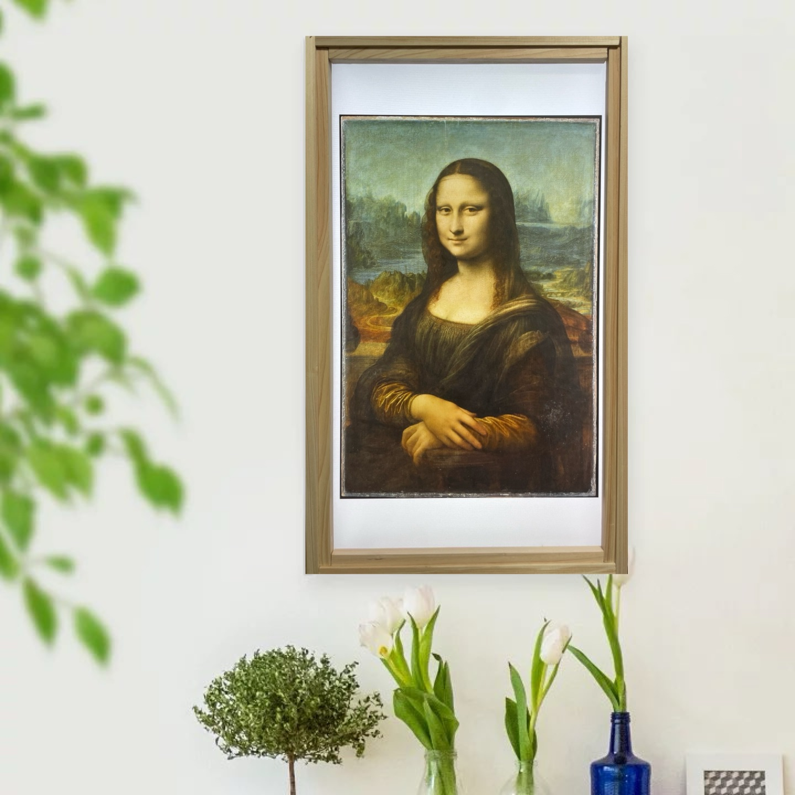
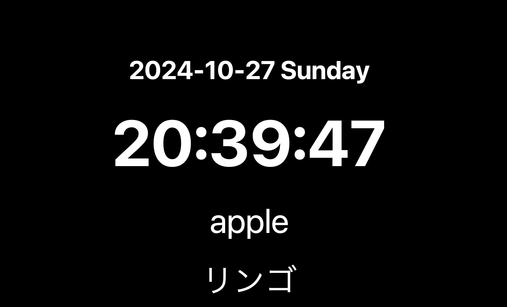

# Image Display App
**思い出の写真を飾り、好きなアートを楽しみながら、日々の時間と天気を確認できるインターフェース**
# 📋主な機能
- 画像ギャラリー表示：選んだフォルダから写真やアートをランダムに表示
- 時計表示：シンプルな時計を画面に
- 天気と降水確率の確認：日々の天気を視覚的に
- 自動調整：指定時間帯での明るさ調整
- 単語学習：単語を自動表示し、日々の学習に

# 🩻イメージ






# 🖥️ システム要件

* python
* パッケージ:
    - **pillow** (画像処理)
    - **tkinter** (UI構築)
    - **opencv-python** (動画サポートのため)
    - **beautifulsoup4** (ウェブデータ取得用)

# 🚀インストール手順

pythonインストール方法
```zsh
brew install python
```

tkinterインストール方法
```zsh
brew install python-tk
```

pillowインストール方法
```zsh
pip install pillow
```

opencvインストール方法

```zsh
pip install opencv-python
```

beautifulsoup4インストール方法

```zsh
pip install beautifulsoup4
```

# 📓利用方法
```zsh
python main.py
```

# 🖼 Image Mode
## - 設定変数
- Image Directory: 画像が保存されているディレクトリを選択してください
- Display Interval: 画像が切り替わるまでの時間
- Show Margin: 余白を表示するか否か
- Automatic Brightness: 明るさを自動調整するか否か（21:00に暗くなり、07:00に明るくなる）
- Show Clock: 時間を表示するか否か（Show Marginもonにする必要があります）
- Show Weather:天気を表示するか否か（Show Marginもonにする必要があります）(Net環境必要)

## - キーバインド
- \<Escape key> or \<q key>: 終了する
- \<b key>: 周りの枠の明るさ調整
- \<i key>: imageの明るさ調整
- \<f key>: ウィンドウ大きさ変更
- \<h key>: カーソル表示切り替え
- \<v key>: 音量の調整
- \<m key>: ミュートの切り替え
- \<Space key>: 次の画像に移動する


# 📺 Movie Mode
- 実装中


# 🧠 Study Mode
## - 設定変数
- Study Directory: 問題が保存されているディレクトリを選択してください
- Answer Interval: 答えが出るまでの時間
- Change Interval: 問題が変わるまでの時間

## - キーバインド
- \<Escape key> or \<q key>: 終了する
- \<Space key>: 暗記完了（ループから削除されて、もう表示されない）
- \<b key>: 明るさ調整


# 💡 Tips
Linux環境で動作させる場合以下のようなファイルを作成すれば、毎度`python main.py`を入力しなくて済み、ファイルをクリックするだけでプログラムが実行されます。
```image_display_app.desktop
[Desktop Entry]
Name=Image Display App
Exec=/usr/bin/python /path/to/main.py
Icon=/path/to/asset/icon.jpeg
Terminal=true
Type=Application
Categories=Utility;
```

## 🌐 おすすめ画像収集サイト
画像収集サイト：
https://www.pexels.com/ja-jp/search/%E9%A2%A8%E6%99%AF/


絵画収集方法：
https://sleepygamersmemo.blogspot.com/2018/11/download-from-wikiart-with-tampermonkey.html

# ❗️注意
使用は自己責任です